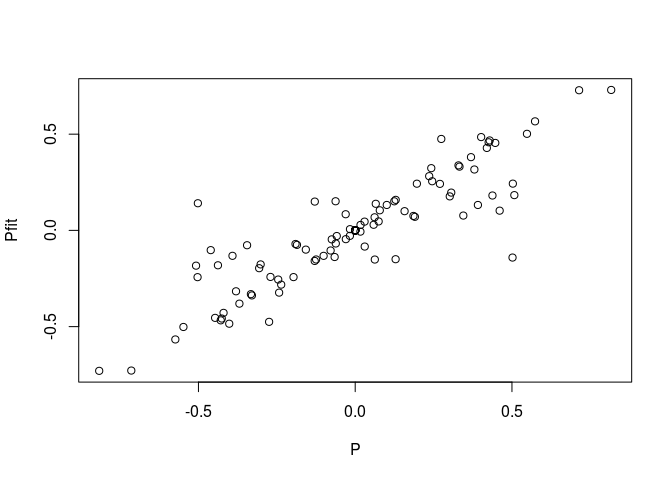
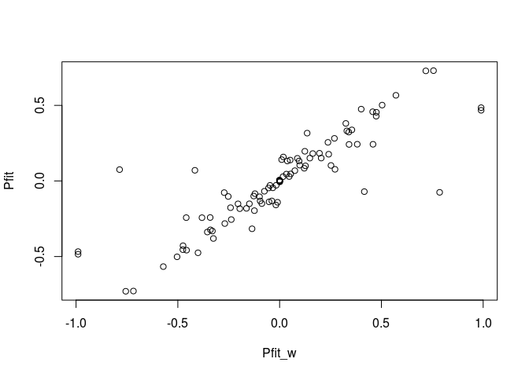
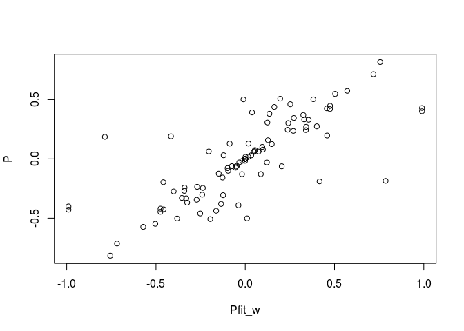
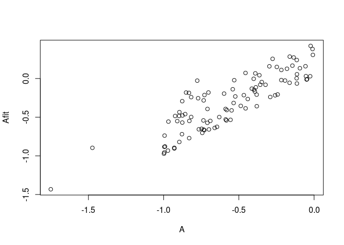
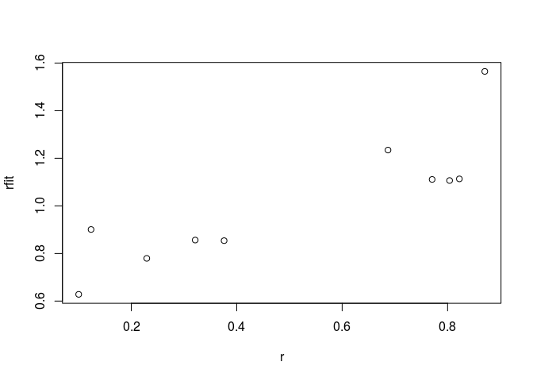
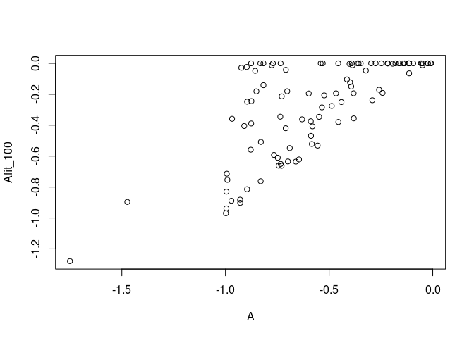
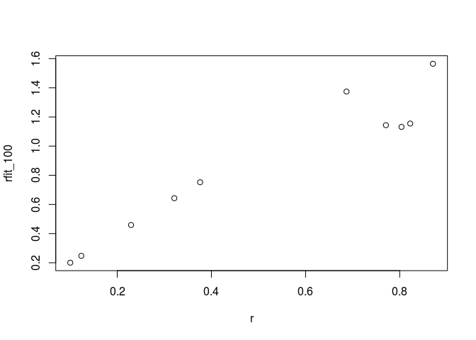
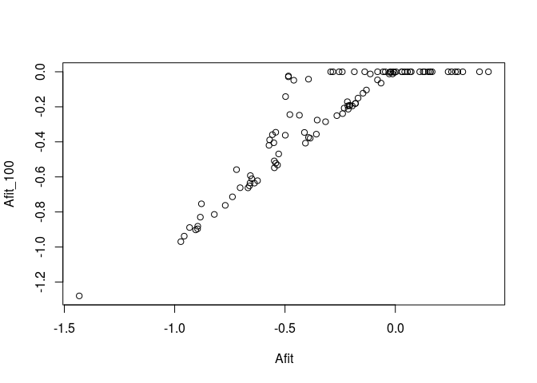

#### Daniel S. Maynard, J. Timothy Wootton, Carlos A. Serván, Stefano Allesina

This markdown file provides a brief walk-through of the different
functions and methods presented in the manuscript. In this repo there
are two main files, `fitting_algae.R` and `fitting_intertidal.R` that
provide step-by-step code for reproducing the results in the main text,
along with a ancillary functions called within these scripts
(`functions_algae.R` and `functions_intertidal.R`).

### Zero-sum replicator example

First, source the R files containing the fitting functions:

``` r
rm(list=ls())
library(limSolve)
library(Matrix)
source("../code/functions_intertidal.R")
source("../code/functions_algae.R")
```

Then, set the seed and the number of species

``` r
set.seed(10)
nspp <- 10
```

Generate a skew-symmetric payoff matrix

``` r
P <- matrix(runif(nspp^2),nspp,nspp)
P <- P-t(P)
round(P,2)
```

    ##        [,1]  [,2]  [,3]  [,4]  [,5]  [,6]  [,7]  [,8]  [,9] [,10]
    ##  [1,]  0.00  0.34  0.44 -0.16  0.19  0.13 -0.24 -0.20  0.25  0.06
    ##  [2,] -0.34  0.00  0.50 -0.50 -0.13  0.51  0.06  0.27  0.07 -0.12
    ##  [3,] -0.44 -0.50  0.00 -0.19 -0.39 -0.46 -0.37  0.40 -0.55  0.24
    ##  [4,]  0.16  0.50  0.19  0.00  0.31 -0.27 -0.43 -0.43 -0.06  0.02
    ##  [5,] -0.19  0.13  0.39 -0.31  0.00  0.03  0.82 -0.45  0.10 -0.42
    ##  [6,] -0.13 -0.51  0.46  0.27 -0.03  0.00  0.30  0.08 -0.38  0.33
    ##  [7,]  0.24 -0.06  0.37  0.43 -0.82 -0.30  0.00 -0.07  0.71  0.03
    ##  [8,]  0.20 -0.27 -0.40  0.43  0.45 -0.08  0.07  0.00  0.02  0.33
    ##  [9,] -0.25 -0.07  0.55  0.06 -0.10  0.38 -0.71 -0.02  0.00  0.57
    ## [10,] -0.06  0.12 -0.24 -0.02  0.42 -0.33 -0.03 -0.33 -0.57  0.00

And generate a relative abundance vector:

``` r
x_equil <- rexp(nspp)
x_equil <- x_equil/sum(x_equil)
round(x_equil,2)
```

    ##  [1] 0.12 0.34 0.04 0.04 0.14 0.21 0.01 0.05 0.02 0.03

First, let’s implement quadratic programming to reconcile P with
x\_equil, assuming each entry is weighted equally:

``` r
result_zero_sum <- find_closest_matrix_weighted(P=P, x=x_equil)
Pfit <- convert_sol_to_matrix(result_zero_sum$X,nspp)
```

We can view the best-fitting payoff matrix

``` r
round(Pfit,2)
```

    ##        [,1]  [,2]  [,3]  [,4]  [,5]  [,6]  [,7]  [,8]  [,9] [,10]
    ##  [1,]  0.00  0.08  0.18 -0.10  0.07 -0.15 -0.32 -0.24  0.26  0.03
    ##  [2,] -0.08  0.00 -0.14 -0.24 -0.16  0.18 -0.15  0.24  0.14 -0.15
    ##  [3,] -0.18  0.14  0.00 -0.08 -0.13 -0.10 -0.38  0.48 -0.50  0.28
    ##  [4,]  0.10  0.24  0.08  0.00  0.20 -0.48 -0.46 -0.47 -0.07 -0.01
    ##  [5,] -0.07  0.16  0.13 -0.20  0.00 -0.08  0.73 -0.45  0.13 -0.43
    ##  [6,]  0.15 -0.18  0.10  0.48  0.08  0.00  0.18  0.10 -0.32  0.34
    ##  [7,]  0.32  0.15  0.38  0.46 -0.73 -0.18  0.00 -0.05  0.73  0.05
    ##  [8,]  0.24 -0.24 -0.48  0.47  0.45 -0.10  0.05  0.00  0.03  0.33
    ##  [9,] -0.26 -0.14  0.50  0.07 -0.13  0.32 -0.73 -0.03  0.00  0.57
    ## [10,] -0.03  0.15 -0.28  0.01  0.43 -0.34 -0.05 -0.33 -0.57  0.00

And compare to the original matrix

``` r
plot(Pfit~P)
```



Last, we can double check that it is indeed an exact an exact solution
by checking the growth rates at x\_equil:

``` r
round(Pfit%*%x_equil,12)
```

    ##       [,1]
    ##  [1,]    0
    ##  [2,]    0
    ##  [3,]    0
    ##  [4,]    0
    ##  [5,]    0
    ##  [6,]    0
    ##  [7,]    0
    ##  [8,]    0
    ##  [9,]    0
    ## [10,]    0

#### Weighted quadratic programming

Now let’s repeat the above analysis, but this time generate a random
matrix of weights, reflecting, for example, different sample sizes for
each entry:

``` r
weight_mat <- matrix(runif(nspp^2),nspp,nspp)
round(weight_mat,2)
```

    ##       [,1] [,2] [,3] [,4] [,5] [,6] [,7] [,8] [,9] [,10]
    ##  [1,] 0.70 0.95 0.55 0.90 0.10 0.59 0.35 0.18 0.72  0.89
    ##  [2,] 0.11 0.89 0.65 0.88 0.72 0.56 0.34 0.08 0.22  0.71
    ##  [3,] 0.33 0.05 0.23 0.20 0.52 0.76 0.13 0.07 0.54  0.67
    ##  [4,] 0.32 0.77 0.08 0.07 0.41 0.75 0.42 0.05 0.66  0.75
    ##  [5,] 0.57 0.23 0.92 0.16 0.41 0.71 0.47 0.52 0.85  0.41
    ##  [6,] 0.20 0.32 0.15 0.33 0.76 0.99 0.53 0.81 0.15  0.05
    ##  [7,] 0.22 0.28 0.82 0.18 0.26 0.45 0.63 0.45 0.67  0.76
    ##  [8,] 0.63 0.71 0.41 0.15 0.76 0.12 0.88 0.56 0.76  0.85
    ##  [9,] 0.35 0.86 0.61 0.29 0.98 0.24 0.68 0.28 1.00  0.53
    ## [10,] 0.86 0.11 0.07 0.94 0.67 0.47 0.72 0.89 0.26  0.87

We can provide this weight matrix as an optional argument to
*find\_closest\_matrix\_weighted*:

``` r
result_zero_sum_w <- find_closest_matrix_weighted(P=P, x=x_equil, weight_mat = weight_mat)
Pfit_w <- convert_sol_to_matrix(result_zero_sum_w$X,nspp)
```

And we can compare this new weighted payoff matrix to the original
best-fitting matrix:

``` r
plot(Pfit~Pfit_w)
```



And to the empirical matrix:

``` r
plot(P~Pfit_w)
```



And once again, it’s an exact solution:

``` r
round(Pfit_w%*%x_equil, 12)
```

    ##       [,1]
    ##  [1,]    0
    ##  [2,]    0
    ##  [3,]    0
    ##  [4,]    0
    ##  [5,]    0
    ##  [6,]    0
    ##  [7,]    0
    ##  [8,]    0
    ##  [9,]    0
    ## [10,]    0

### Lotka Volterra Example

To fit Lotka-Volterra, we need an estimate of the growth rates and the
interaction matrix. So first generate growth rates (r), interaction
matrix (A), and a species abundance vector (x\_obs):

``` r
r <- runif(nspp)
A <- -matrix(runif(nspp^2), nspp,nspp)
diag(A) <- diag(A)*2
x_obs <- runif(nspp)
round(A,2)
```

    ##        [,1]  [,2]  [,3]  [,4]  [,5]  [,6]  [,7]  [,8]  [,9] [,10]
    ##  [1,] -0.78 -0.74 -0.73 -0.83 -0.88 -0.03 -0.88 -0.16 -0.82 -0.59
    ##  [2,] -0.53 -0.63 -0.18 -0.92 -0.16 -0.05 -0.86 -0.35 -0.01 -0.74
    ##  [3,] -0.46 -0.55 -1.75 -0.30 -1.00 -1.00 -0.97 -0.01 -0.36 -0.58
    ##  [4,] -0.85 -0.58 -0.60 -1.47 -0.69 -0.11 -0.70 -0.40 -0.73 -0.29
    ##  [5,] -0.22 -0.05 -0.22 -0.41 -0.46 -0.93 -0.99 -0.59 -0.40 -1.00
    ##  [6,] -0.77 -0.49 -0.14 -0.02 -0.77 -0.05 -0.54 -0.88 -0.87 -0.70
    ##  [7,] -0.28 -0.71 -0.82 -0.39 -0.99 -0.97 -0.90 -0.71 -0.14 -0.26
    ##  [8,] -0.90 -0.12 -0.36 -0.25 -0.75 -0.93 -0.91 -0.39 -0.12 -0.24
    ##  [9,] -0.52 -0.90 -0.44 -0.47 -0.73 -0.56 -0.09 -0.38 -0.39 -0.38
    ## [10,] -0.83 -0.73 -0.11 -0.32 -0.83 -0.65 -0.53 -0.19 -0.06 -0.66

``` r
round(r,2)
```

    ##  [1] 0.12 0.10 0.69 0.87 0.77 0.32 0.23 0.38 0.80 0.82

``` r
round(x_obs,2)
```

    ##  [1] 0.96 0.25 0.58 0.83 0.20 0.07 0.75 0.57 0.74 0.08

Instead of using “find\_closest\_matrix\_weighted”, as we did for the
payoff matrix above, here we using the function “fit\_qp\_LV”. We assign
a large tolerance (10,000% deviation possible) allowing each entry to
vary as needed to obtain the optimal solution:

``` r
result_LV <- fit_qp_LV(A=A,r=r,x_obs=x_obs,tol=1000)
```

And we convert the solution into the fitted matrix and growth rate
vector:

``` r
Afit <- t(matrix(result_LV$X[1:nspp^2], nspp,nspp))
rfit <- result_LV$X[(nspp^2+1):(nspp^2+nspp)]
round(Afit,2)
```

    ##        [,1]  [,2]  [,3]  [,4]  [,5]  [,6]  [,7]  [,8]  [,9] [,10]
    ##  [1,] -0.03 -0.54 -0.28 -0.19 -0.72  0.03 -0.29  0.28 -0.24 -0.53
    ##  [2,] -0.02 -0.50  0.13 -0.48 -0.06 -0.01 -0.46 -0.05  0.38 -0.70
    ##  [3,]  0.07 -0.41 -1.43  0.16 -0.88 -0.96 -0.56  0.31  0.04 -0.54
    ##  [4,] -0.18 -0.41 -0.19 -0.90 -0.55 -0.06 -0.18  0.00 -0.21 -0.24
    ##  [5,]  0.11  0.03 -0.02 -0.13 -0.39 -0.90 -0.74 -0.39 -0.15 -0.97
    ##  [6,] -0.25 -0.35  0.17  0.42 -0.66 -0.01 -0.14 -0.57 -0.48 -0.66
    ##  [7,]  0.25 -0.57 -0.50  0.07 -0.88 -0.93 -0.48 -0.39  0.27 -0.22
    ##  [8,] -0.43  0.00 -0.08  0.15 -0.65 -0.90 -0.55 -0.11  0.24 -0.21
    ##  [9,] -0.23 -0.82 -0.26 -0.22 -0.67 -0.53  0.13 -0.21 -0.17 -0.36
    ## [10,] -0.55 -0.66  0.06 -0.08 -0.77 -0.62 -0.32 -0.03  0.16 -0.64

``` r
round(rfit,2)
```

    ##  [1] 0.90 0.63 1.23 1.56 1.11 0.86 0.78 0.85 1.11 1.11

We can compare these fitted parameters to their empirical counterparts:

``` r
plot(Afit~A)
```



``` r
plot(rfit~r)
```



Lastly, we can double check that the fitted values are indeed exact
solutions:

``` r
round(x_obs*(rfit+Afit%*%x_obs),12)
```

    ##       [,1]
    ##  [1,]    0
    ##  [2,]    0
    ##  [3,]    0
    ##  [4,]    0
    ##  [5,]    0
    ##  [6,]    0
    ##  [7,]    0
    ##  [8,]    0
    ##  [9,]    0
    ## [10,]    0

#### Constraining the entries to be within a fixed percentage of the observed values

The *fit\_qp\_LV* function can be used to search for a solution within a
fixed radius around each empirical value

Here, let’s set the tolerance to within +/- 100% of the observed values
by specifying tol=1.00

``` r
result_LV_100 <- fit_qp_LV(A=A,r=r,x_obs=x_obs,tol=1.00)
```

And we can extract the fitted interaction matrix and growth rate vector:

``` r
Afit_100 <- t(matrix(result_LV_100$X[1:nspp^2], nspp,nspp))
rfit_100 <- result_LV_100$X[(nspp^2+1):(nspp^2+nspp)]
round(Afit_100,2)
```

    ##        [,1]  [,2]  [,3]  [,4]  [,5]  [,6]  [,7]  [,8]  [,9] [,10]
    ##  [1,] -0.01 -0.35  0.00  0.00 -0.56  0.00  0.00  0.00  0.00 -0.47
    ##  [2,]  0.00 -0.36  0.00 -0.03  0.00  0.00 -0.05  0.00  0.00 -0.66
    ##  [3,]  0.00 -0.35 -1.28  0.00 -0.83 -0.94 -0.36  0.00  0.00 -0.52
    ##  [4,] -0.18 -0.41 -0.19 -0.90 -0.55 -0.06 -0.18  0.00 -0.21 -0.24
    ##  [5,]  0.00  0.00  0.00 -0.10 -0.38 -0.90 -0.71 -0.37 -0.12 -0.97
    ##  [6,]  0.00 -0.28  0.00  0.00 -0.59 -0.01  0.00 -0.39 -0.24 -0.63
    ##  [7,]  0.00 -0.42 -0.14  0.00 -0.75 -0.89 -0.02 -0.04  0.00 -0.17
    ##  [8,] -0.25  0.00  0.00  0.00 -0.61 -0.88 -0.41 -0.01  0.00 -0.19
    ##  [9,] -0.21 -0.81 -0.25 -0.19 -0.66 -0.53  0.00 -0.19 -0.15 -0.36
    ## [10,] -0.51 -0.65  0.00 -0.05 -0.76 -0.62 -0.29  0.00  0.00 -0.64

``` r
round(rfit_100,2)
```

    ##  [1] 0.25 0.20 1.37 1.56 1.14 0.64 0.46 0.75 1.13 1.15

Now compare these fitted objects to the originals. Note that it sets a
bunch of interactions to be zero:

``` r
plot(Afit_100~A)
```



``` r
plot(rfit_100~r)
```



Lastly, we can compare the two fits, both with and without the
constraints:

``` r
plot(Afit_100~Afit)
```



And once again verify that the constrained parameters provide an exact
solution:

``` r
round(x_obs*(rfit_100+Afit_100%*%x_obs),12)
```

    ##       [,1]
    ##  [1,]    0
    ##  [2,]    0
    ##  [3,]    0
    ##  [4,]    0
    ##  [5,]    0
    ##  [6,]    0
    ##  [7,]    0
    ##  [8,]    0
    ##  [9,]    0
    ## [10,]    0

Under the hood, the functions *fit\_qp\_LV* and
*find\_closest\_matrix\_weighted* both call the function *lsei* from the
`limSolve` package to implement the quadratic programming step. Please
see the *lsei* documentation for more details, and also take a look at
the functions *fit\_qp\_LV* and *find\_closest\_matrix\_weighted* in the
files `functions_algae.R` and `functions_intertidal.R`, respectively, to
see exactly how these constraints are formulated and implemented.
